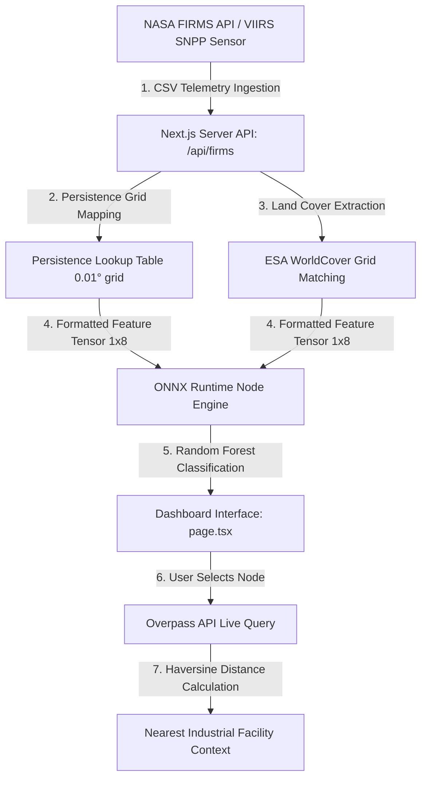

# SIH Evaluator Briefing & Project Defense Guide
**Project Title:** AI-Based Detection and Classification of Industrial Fires and Persistent Thermal Sources

This guide compiles the complete technical knowledge base of the prototype, mapping the problem statement, pipeline architecture, interface features, and key cross-examination defenses to help you ace your evaluation.

---

## 1. The Core Problem Statement & Context
### Background
Industrial complexes (refineries, steel plants, power installations, LNG terminals) emit significant thermal energy. These activities, along with accidental explosions or uncontrolled flare leaks, show up as thermal anomalies on Earth-observing satellites. 

### The Industry Challenge
* **The Blindspot of NASA FIRMS:** Standard systems like NASA FIRMS (Fire Information for Resource Management System) detect heat anomalies (Active Fires) using infrared sensors, but they **cannot distinguish** what caused the fire. A wildfire, a wheat-stubble agricultural burn, and a petrochemical refinery flare all appear identical: a coordinate point with a thermal energy reading.
* **Why Categorization Matters:** Emergency responders, environmental monitoring boards, and industrial safety regulators need to isolate structural/industrial thermal occurrences from natural forest fires or agricultural clearing to target hazard responses.
* **Expected Solution:**
  1. An AI-enabled system to segregate industrial thermal sources/fires from forest/agricultural/natural fires.
  2. A GIS-based visualization overlay for storage, querying, and interactive mapping.

---

## 2. Our Implemented Solution Architecture
The prototype is a **lightweight, high-performance serverless GIS platform** built on a Next.js framework. It classifies anomalies in real time without requiring heavy, slow Python runtimes at the production layer.

### System Pipeline

### The 8 Machine Learning Features (Input Tensor Structure)
The model expects an input shape of `[1, 8]` of type `float32`. Every feature has a specific physical and geospatial meaning:
1. `bright_ti4` (K): Brightness temperature of the VIIRS I-4 channel (3.74 µm band). Extremely sensitive to hot, concentrated sub-pixel combustion sources (e.g., gas flares, steel furnaces).
2. `bright_ti5` (K): Brightness temperature of the VIIRS I-5 channel (11.45 µm band). Represents background surface temperatures (cool ground, cloud tops).
3. `frp` (MW): Fire Radiative Power. The rate of radiant heat energy emitted by the fire. Industrial processes have highly concentrated energy footprints.
4. `confidence`: Mapped ordinal score for detection reliability (`l` $\rightarrow$ 0, `n` $\rightarrow$ 1, `h` $\rightarrow$ 2).
5. `scan` (km): Pixel scan width along the satellite track. Controls for spatial resolution skew.
6. `track` (km): Pixel track width along the satellite track. Controls for spatial resolution skew.
7. `persistence_count`: The number of times a thermal anomaly has recurred in the exact same 0.01° grid cell (approx. 1.1 km²). **Key signature:** Industrial sources are persistent (flaring or furnace emissions occur week after week), whereas forest fires or crop burns are transient.
8. `land_cover_class`: ESA WorldCover classification index (e.g., Class 10 = Trees, Class 30 = Grassland, Class 50 = Built-up/Urban). **Key signature:** Industrial fires happen on built-up ground (Class 50), while forest fires occur in woodland (Class 10).

---

## 3. Detailed Interface & Button Manual

Here is exactly how to operate the dashboard during your demo, and what each control does under the hood:

### A. Top Navigation Bar & Global Controls
* **Brand Logo:** Located top-left. Features a minimalist, high-contrast, brutalist indicator.
* **Go Live / Run Demo Segmented Switcher:** 
  * **Go Live Button:** Sends a query to the `/api/firms` backend. The backend contacts NASA FIRMS API to fetch live VIIRS satellite observations over India from the last 24 hours. The backend maps land cover, queries persistence, runs ONNX inference, and returns active real-time classifications.
  * **Run Demo Button:** Loads the preprocessed static dataset of 3,000 points. Use this to show a complete historical distribution when live satellite feeds are quiet.
* **Reload Feed Icon (Circular Arrow):** Forces a query refresh to fetch the latest observations without reloading the entire browser tab.

### B. KPI Metrics Panel
Displays five critical numbers based on your current filters:
1. **Active Anomalies:** Total number of thermal hotspots currently matching your filters.
2. **Industrial Candidates:** Number of anomalies classified as Class 1 (Industrial Source) by the Random Forest model.
3. **Persistent Sources:** Number of hotspots residing in cells that have been flagged $\ge 10$ times.
4. **High Threat Priority:** Number of points meeting high-hazard conditions (Industrial classification + FRP $\ge 15.0$ MW + Persistence $\ge 10$).
5. **Last Feed Refresh:** A clock timestamp confirming the exact second the telemetry was parsed.

### C. Filtering Toolbar (The Operations Console)
* **All / Industrial / Other Filter Toggle:**
  * **All:** Shows all thermal anomalies.
  * **Industrial:** Shows only anomalies classified by the model as industrial fires or structural flares (Class 1, marked in orange-red).
  * **Other:** Shows anomalies classified as vegetation/forest/wildfires/agricultural burning (Class 0, marked in blue).
* **Min FRP Slider:** Filters out low-intensity anomalies. Dragging this to the right isolates high-energy thermal events (e.g. refineries, volcanic action, active heavy furnace vents).
* **Min Persistence Slider:** Drag this to filter out transient events. Set it to $\ge 5$ to remove crop burning or short-lived forest fires, instantly isolating static industrial sources.
* **Search Grid Input:** Enter coordinates (e.g. `22.4, 72.1`), ESA landcover class name (e.g., `Urban`), or nearest facility context to filter down matching points instantly.

### D. Map Component & GIS Visualization
* **Tile Theme:** Grayscale-filtered OpenStreetMap tiles, providing a light, high-contrast, professional monitoring theme that makes classification markers pop.
* **Orange-Red Circles:** Classified Industrial Sources.
* **Blue Circles:** Classified Other/Natural fires.
* **Dashed Rings:** Visual indicators for **High Priority Threats**. This immediately draws the evaluator's attention to critical threats.
* **Interaction:** Clicking any circle marker selects that detection and centers the map over its coordinates.
* **Legend Overlay:** Displays visual representations of classifications and marker scale mechanics (circle radius dynamically scales with FRP).

### E. Telemetry Diagnostics Sidepanel (Detail Panel)
Appears on the right when you click a map marker or table row:
* **Priority Badge:** Color-coded priority tags (`HIGH` in red, `MEDIUM` in amber, `LOW` in gray).
* **AI Inference Results Box:** Shows the model output label and the raw probability score (e.g. 84.7% confidence) from the ONNX session.
* **ESA Land Cover Display:** Confirms the exact ecological ground cover (e.g., "Trees", "Built-Up", "Cropland").
* **OSM Context Section:** Displays live OpenStreetMap Overpass queries. If clicked, the app sends the coordinates to a server handler that queries OSM for the nearest industrial facilities (refineries, power stations, industrial zones) within a 5 km radius, calculating and displaying the exact distance using the Haversine formula.

---

## 4. Expected Cross-Questions & Technical Defense

Prepare these exact defenses to address typical evaluator critiques:

### Q1: "Where does your model run? Do you query a Python API?"
> **Defense:** "No. To maximize execution speed, reduce host dependencies, and achieve sub-millisecond classification, we converted our final trained Scikit-Learn model into **ONNX format** (Open Neural Network Exchange). The Next.js backend runs inference directly in the Node.js runtime using the native `onnxruntime-node` package. It takes an array of 8 coordinates/parameters and returns a class label and probabilities in under 2 milliseconds without any Python server overhead."

### Q2: "How did you compute persistence? Satellite observations are coordinate-specific, and satellites drift."
> **Defense:** "Satellites do not return exact coordinate matches on subsequent orbits due to atmospheric refractions and path angles. To resolve this, we grouped the globe into a uniform grid of **0.01° cells** (roughly 1.1 km²). We calculated historical recurrence by mapping every satellite observation to its nearest grid cell. We pre-compiled this cell-to-count mapping into a JSON hash map (`src/data/persistence_lookup.json`). At runtime, we extract the coordinates, snap them to the grid, and retrieve the exact persistence count instantly."

### Q3: "What is the accuracy of your classification model?"
> **Defense:** "Our model achieves approximately **84% validation accuracy** on historical records, trained on OSM-assisted and verified industrial facility locations. Since satellite data contains noise, our methodology page explicitly outlines a critical disclaimer: the system is designed to provide *decision-support signals* rather than absolute ground-truth incident confirmation. Ground validation is always recommended to verify satellite warnings."

### Q4: "How does your system query OpenStreetMap? Does it load a massive database?"
> **Defense:** "No. Loading a global OSM GIS database is too heavy. Instead, our app queries the **Overpass API interpreter** dynamically on demand. When a user selects a specific hotspot, the server makes a live HTTP request to fetch industrial nodes/ways within a 5 km bounding box. We then parse the response, find the closest facility, and calculate the exact distance using the Haversine formula."

### Q5: "If your NASA FIRMS API key is invalid or fails, does your system break?"
> **Defense:** "No. The system is designed to be highly resilient. The backend contains an automatic parsing system that checks the loaded environment, `.env.local`, `.env`, and `.env.example` to extract the `FIRMS_MAP_KEY`. If the key is missing, invalid, or NASA's server returns a key error, our system intercepts it, falls back to our local preprocessed database of 3,000 points, and shifts the UI into Demo Mode. This guarantees the map and tables never freeze or crash."

### Q6: "Why did you choose a light brutalist theme with desaturated tiles?"
> **Defense:** "In operational command rooms, visual fatigue is a major factor, and colorful maps distract from critical alerts. Our theme desaturates OpenStreetMap tiles to remove standard map noise while keeping the interface highly legible. By using pure light styling and solid colors without gradients, we align with modern Brutalist GIS dashboards (such as aeronautical telemetry consoles) to maximize the contrast of active thermal alerts."
